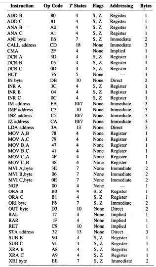
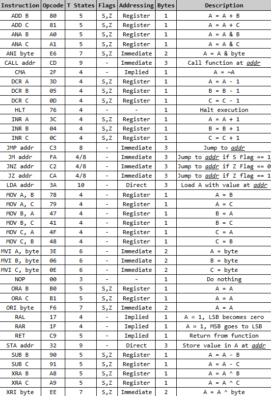

# SAP2-Interpreter
Interpreter do microprocessador "Simple-As-Possible 2".
De preferência, leia todo esse guia antes de usar o interpretador.

## Como usar?
Obtenha o arquivo executável específico para seu caso _(Windows/Linux, ARM, ...)_ e execute-o da
forma como será mostrada abaixo.

## Comando:
O comando para executar o programa é: 
```bash
[arquivo_executavel] [arquivo] [parametros]
```
Observações:
- O `[arquivo_executavel]` vai estar em função do sistema do usuário (Windows/Linux, ARM, ...).
Então, por exemplo, se o seu sistema for Windows (x64 ou x86), seu comando se aparentaria com:
```bash
./sap2-interpreter-windows arquivo.asm
```
- O arquivo, necessariamente, vem antes dos parâmetros.

Um exemplo de comando para o sistema operacional Ubuntu seria:
```bash
./sap2-interpreter-linux.exe test.asm
```

### Parâmetros:
Os parâmetros que podem ser usados são são:
- `--inicio <hexadecimal>`  ou `-i <hexadecimal>`: onde o contador de programa começará (no endereço `<hexadecimal>`). O padrão é `8000H`;
- `--limite-instrucoes <numero>` ou `-li <numero>`: define a quantidade máxima de instruções que serão executadas (dado pelo inteiro positivo `<numero>`). O padrão é ilimitado(`-1`);
- `--saida-limpa` ou `-sl`: desativa a impressão da tabela que mostra a memória no fim do programa (ao usar `HLT`).
- `--debug`, `-d`, `--passo-a-passo` ou `-p`: ativa o modo de depuração, que executa uma instrução 
por vez, mostrando informações a cada execução (como o valor dos registradores e dos flag);
- `--limite-tempo <numero>` ou `-lt <numero>`: define o tempo máximo, em milissegundos, que o programa poderá executar
  (dado pelo número _double_ `<numero>`, em milissegundos). Parâmetro útil quando o código for um _loop infinito_. O padrão é `10000ms`(`10seg`).

Por exemplo:
```bash
./sap2-interpreter-windows test.asm --inicio 1000H
```
- Nesse caso, o programa compilará o arquivo test.asm e começará a anotar as instruções a
  partir do endereço de memória `1000H`.
    - Observação: nesse programa, todo número hexadecimal termina com H.

Outro exemplo que usaria a saída limpa e o modo de depuração:
```bash
./sap2-interpreter-windows test.asm --inicio 2000H --saida-limpa -d
```

É interessante citar que a ordem que os parâmetros são escritos não importa, apenas que o próximo texto em
seguida deles seja seu(s) parâmetro(s) _(se houver)_. 
Por exemplo,
`
./sap2-interpreter-linux codigo.asm --inicio 1000H -sl
`
e
`
./sap2-interpreter-linux codigo.asm -sl --inicio 1000H
`
funcionariam, ao mesmo tempo que
`
./sap2-interpreter-linux codigo.asm 1000H --inicio -sl
`
não funcionaria.


## Código exemplar:
```asm
; Carrega os registradores
MVI A, 1H
MVI B, 2H
MVI C, 3H

; Faz algumas operações
ADD B ; A = A+B
OUT 0H

ADD C ; A = (A+B)+C
OUT 0H

SUB B ; A = (A+B+C)-B = A+C
OUT 0H
```

## Instruções
As instruções aceitas pelo programa são: 



As funções de algumas instruções podem ser encontradas nesta imagem:


## Rótulos
Para poder "apelidar" um endereço de memória, utilize rótulos:
```asm
; Loop simples que acaba quando o registrador A
; se tornar 0
LOOP:
DCR A
JNZ LOOP
```
Ademais, você também pode "apelidar" o valor de um endereço de memória, como se fosse
uma constante:
```asm
; O rótulo ENDERECO_SALVAR guarda o valor de 
; endereço de memória 1234H
ENDERECO_SALVAR: 1234H

; Salva o valor do acumulador no endereco 
; do rótulo ENDERECO_SALVAR
STA ENDERECO_SALVAR
```

_Observação final: o programa é um interpretador (e não um compilador), uma vez que o código
do SAP2 é executado dentro do programa, ao invés do programa gerar um arquivo em código de máquina._